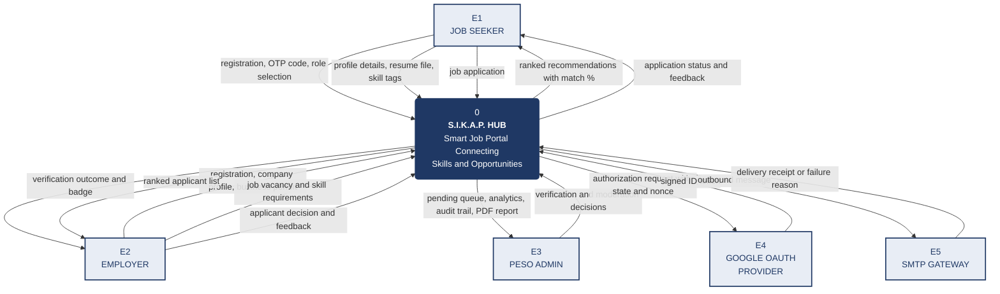
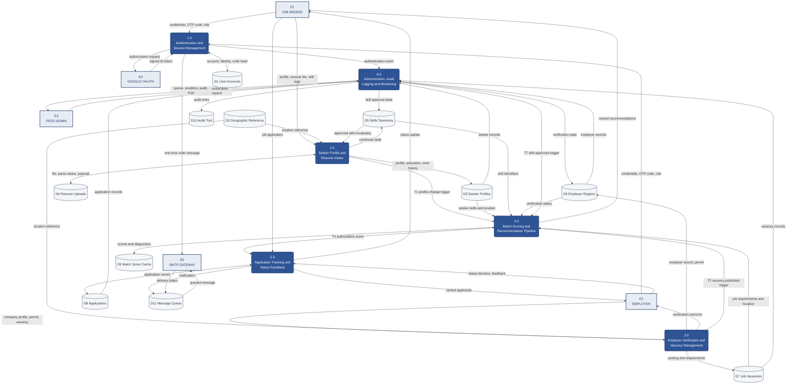
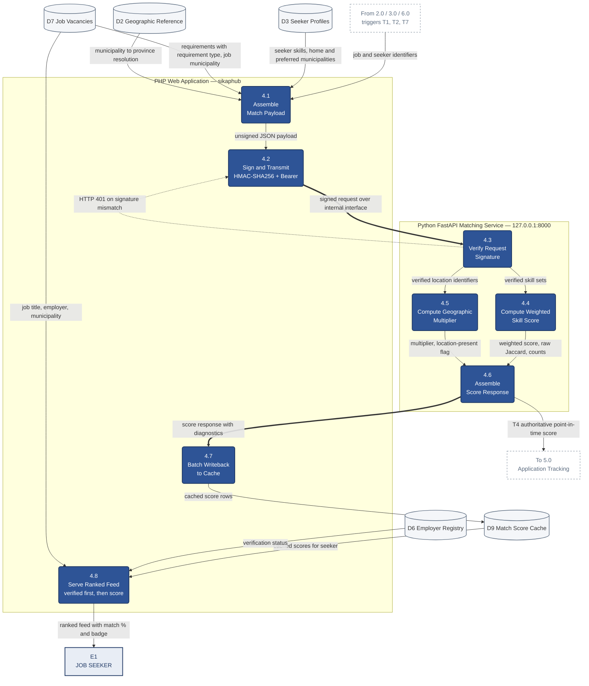

# Data Flow Diagram Specification

**SMART INTEGRATED KNOWLEDGE & ABILITY PLATFORM (S.I.K.A.P.) HUB**

| | |
|---|---|
| Version | 2.0 |
| Date | 21 August 2026 |
| Derived from | M2 Locked System Flow · 26-relation 3NF schema |
| Diagrams | Context · Level 0 · Low-Level (Process 4.0) |

**Numbering convention.** This document follows the sequence used in your March submission: Context Diagram → Level 0 (system overview) → Low-Level (sub-process decomposition). If Sir Eli prefers the alternative convention where the Context Diagram *is* Level 0 and the overview is Level 1, that is a relabelling only — the diagrams themselves do not change.

**Notation.** Gane–Sarson conventions, rendered in Mermaid:

| Element | Shape | Mermaid |
|---|---|---|
| External entity | Sharp rectangle | `[Name]` |
| Process | Rounded rectangle | `("N.0 Name")` |
| Data store | Open cylinder | `[("Dn Name")]` |
| Data flow | Labelled arrow | `-->|"data name"|` |

Data flow labels are **nouns** — the data in motion — never verbs. Verbs belong inside process bubbles.

---

## 1. External entities

| ID | Entity | Role |
|---|---|---|
| **E1** | Job Seeker | Registers, builds a profile, receives ranked recommendations, applies, tracks outcomes |
| **E2** | Employer | Registers, submits company profile and business permit, publishes vacancies, reviews ranked applicants |
| **E3** | PESO Admin | Verifies employers, moderates the skill taxonomy, monitors labour analytics, exports reports |
| **E4** | Google OAuth Provider | External identity provider. Returns a signed ID token asserting email ownership |
| **E5** | SMTP Gateway | External mail relay. Delivers one-time codes and status notifications |

**Why E4 and E5 are external and the AI service is not.** Google and the mail relay are third-party systems outside your control and outside your deployment. The Python matching service is yours: you wrote it, you deploy it, you version it. It sits **inside** the system boundary as a distinct process, with a trust boundary drawn at the network hop. That distinction is the single most important correction from the March diagrams, which showed matching as an ordinary internal process with no service boundary at all.

---

## 2. Data stores

Eleven logical stores grouped from the 26 relations. Grouping related tables into logical stores is standard DFD practice — a store represents data at rest, not a table.

| ID | Store | Relations |
|---|---|---|
| **D1** | User Accounts | `users`, `user_auth_identities`, `email_otp_codes`, `user_devices` |
| **D2** | Geographic Reference | `lib_regions`, `lib_provinces`, `lib_municipalities`, `lib_barangays` |
| **D3** | Seeker Profiles | `job_seekers`, `education`, `work_experience`, `job_preferences`, `preferred_work_locations` |
| **D4** | Resume Uploads | `resume_uploads` |
| **D5** | Skills Taxonomy | `skill_categories`, `master_skills`, `jobseeker_skills` |
| **D6** | Employer Registry | `employers` |
| **D7** | Job Vacancies | `job_postings`, `job_required_skills` |
| **D8** | Applications | `applications` |
| **D9** | Match Score Cache | `job_match_scores` |
| **D10** | Audit Trail | `audit_logs` |
| **D11** | Message Queue | `notifications`, `email_log` |

---

## 3. Context Diagram

### 3.1 Flow table

| # | From | To | Data |
|---|---|---|---|
| C1 | E1 Job Seeker | System | Registration request, email address, one-time code, role selection |
| C2 | E1 Job Seeker | System | Profile details, resume file, confirmed skill tags, preferred municipalities |
| C3 | E1 Job Seeker | System | Job application submission |
| C4 | System | E1 Job Seeker | Ranked job recommendations with match percentage and verification badge |
| C5 | System | E1 Job Seeker | Application status, captured match score, employer feedback |
| C6 | E2 Employer | System | Registration request, company profile, business permit document |
| C7 | E2 Employer | System | Job vacancy details, mandatory and preferred skill requirements |
| C8 | E2 Employer | System | Applicant decision and feedback text |
| C9 | System | E2 Employer | Verification outcome and badge state |
| C10 | System | E2 Employer | Applicant list ranked by match score, with skill breakdown |
| C11 | E3 PESO Admin | System | Employer verification decision, skill moderation decision, report parameters |
| C12 | System | E3 PESO Admin | Pending verification queue, labour market analytics, audit trail, PDF report |
| C13 | System | E4 Google OAuth | Authorization request with state and nonce |
| C14 | E4 Google OAuth | System | Signed ID token containing verified email and subject claim |
| C15 | System | E5 SMTP Gateway | Outbound message: one-time code or status notification |
| C16 | E5 SMTP Gateway | System | Delivery receipt or failure reason |

### 3.2 Mermaid source

---

## 4. DFD Level 0 — System Overview

### 4.1 Processes

| ID | Process | Responsibility |
|---|---|---|
| **1.0** | Authentication and Session Management | OAuth handshake, OTP issue and verification, role selection, session and device tokens |
| **2.0** | Seeker Profile and Resume Intake | Profile building via manual entry or resume parsing, skill confirmation, location capture |
| **3.0** | Employer Verification and Vacancy Management | Company registration, permit submission, verification state, vacancy publication |
| **4.0** | Match Scoring and Recommendation Pipeline | Payload assembly, signed transmission to the matching service, score cache, ranked feed |
| **5.0** | Application Tracking and Status Feedback | Application submission with score capture, employer review, status propagation |
| **6.0** | Administration, Audit Logging and Monitoring | Verification queue, skill moderation, analytics, report export, audit trail |

### 4.2 Flow table

| # | From | To | Data |
|---|---|---|---|
| L1 | E1 / E2 | 1.0 | Email address, one-time code, role selection |
| L2 | 1.0 | E4 | Authorization request |
| L3 | E4 | 1.0 | Signed ID token |
| L4 | 1.0 | D1 | Account record, identity link, hashed code, device token |
| L5 | D1 | 1.0 | Stored identity and code hash for verification |
| L6 | 1.0 | 6.0 | Authentication event (success, failure, code request) |
| L7 | 1.0 | E5 | One-time code message |
| L8 | E1 | 2.0 | Profile details, resume file, confirmed skill tags |
| L9 | 2.0 | D4 | Stored file, parse status, extracted payload |
| L10 | D2 | 2.0 | Municipality and barangay reference list |
| L11 | D5 | 2.0 | Approved skill vocabulary |
| L12 | 2.0 | D3 | Seeker profile, education, work history, preferred locations |
| L13 | 2.0 | D5 | Confirmed seeker skills, proposed new skills |
| L14 | 2.0 | 4.0 | Profile-change trigger (T1) |
| L15 | E2 | 3.0 | Company profile, business permit, vacancy details |
| L16 | D2 | 3.0 | Municipality reference list |
| L17 | 3.0 | D6 | Employer record, permit path, verification state |
| L18 | 3.0 | D7 | Job posting and skill requirements |
| L19 | 3.0 | 4.0 | Vacancy-published trigger (T2) |
| L20 | 3.0 | E2 | Verification outcome and badge state |
| L21 | D3, D5, D7, D2 | 4.0 | Seeker skills, job requirements, location identifiers |
| L22 | 4.0 | D9 | Computed scores, diagnostics, engine version |
| L23 | D9 | 4.0 | Cached scores for feed assembly |
| L24 | D6 | 4.0 | Employer verification status for feed ordering |
| L25 | 4.0 | E1 | Ranked recommendations with match percentage and badge |
| L26 | E1 | 5.0 | Job application |
| L27 | 4.0 | 5.0 | Authoritative point-in-time score (T4) |
| L28 | 5.0 | D8 | Application record with captured score |
| L29 | D8 | 5.0 | Application list for employer review |
| L30 | 5.0 | E2 | Ranked applicants with skill breakdown |
| L31 | E2 | 5.0 | Status decision and feedback text |
| L32 | 5.0 | D11 | Notification and outbound message |
| L33 | 5.0 | E1 | Application status update |
| L34 | E3 | 6.0 | Verification decision, moderation decision, report parameters |
| L35 | D6, D7, D3, D8 | 6.0 | Aggregated records for analytics |
| L36 | 6.0 | D6 | Updated verification state |
| L37 | 6.0 | D5 | Skill approval state |
| L38 | 6.0 | D10 | Audit entry |
| L39 | 6.0 | 4.0 | Skill-approved trigger (T7) |
| L40 | 6.0 | E3 | Pending queue, analytics, audit trail, PDF report |
| L41 | D11 | E5 | Queued outbound message |
| L42 | E5 | D11 | Delivery status or failure reason |

### 4.3 Mermaid source

---

## 5. DFD Low-Level — Process 4.0 Decomposition

This is the diagram the March submission was missing entirely. It is where the decoupled architecture becomes visible.

### 5.1 Sub-processes

| ID | Sub-process | Location | Responsibility |
|---|---|---|---|
| **4.1** | Assemble Match Payload | PHP | Gather seeker skills, job requirements, and location identifiers into the request body |
| **4.2** | Sign and Transmit Request | PHP | Compute HMAC-SHA256 over the raw body, attach Bearer token, POST over the internal interface |
| **4.3** | Verify Request Signature | Python | Recompute HMAC, constant-time compare, reject with HTTP 401 on mismatch |
| **4.4** | Compute Weighted Skill Score | Python | Mandatory ×2.0, Preferred ×1.0, normalised to 0–1 |
| **4.5** | Compute Geographic Multiplier | Python | Tiered proximity: 1.00 / 0.90 / 0.75 / 0.50, neutral 1.00 when location is unknown |
| **4.6** | Assemble Score Response | Python | Combine score and multiplier, attach diagnostics and engine version |
| **4.7** | Batch Writeback to Cache | PHP | Persist scores to D9, keyed by job and seeker |
| **4.8** | Serve Ranked Feed | PHP | Read the cache, apply the two-key sort, render with badges and percentages |

### 5.2 Flow table

| # | From | To | Data |
|---|---|---|---|
| M1 | 2.0 / 3.0 / 6.0 | 4.1 | Trigger event (T1, T2, T7) with job and seeker identifiers |
| M2 | D3 | 4.1 | Seeker skill identifiers, home municipality, preferred municipalities |
| M3 | D7 | 4.1 | Job skill requirements with requirement type, job municipality |
| M4 | D2 | 4.1 | Municipality-to-province resolution for the province tier |
| M5 | 4.1 | 4.2 | Unsigned JSON payload |
| M6 | 4.2 | 4.3 | Signed request: body, HMAC signature header, Bearer token |
| M7 | 4.3 | 4.2 | HTTP 401 rejection on signature mismatch |
| M8 | 4.3 | 4.4 | Verified skill sets |
| M9 | 4.3 | 4.5 | Verified location identifiers |
| M10 | 4.4 | 4.6 | Weighted skill score, raw Jaccard, met and total counts |
| M11 | 4.5 | 4.6 | Geographic multiplier and location-present flag |
| M12 | 4.6 | 4.7 | Score response with diagnostics and engine version |
| M13 | 4.7 | D9 | Cached score rows |
| M14 | D9 | 4.8 | Cached scores for the requesting seeker |
| M15 | D6 | 4.8 | Employer verification status |
| M16 | D7 | 4.8 | Job title, employer, municipality, badge fields |
| M17 | 4.8 | E1 | Ranked feed with match percentage and verification badge |
| M18 | 4.6 | 5.0 | Authoritative point-in-time score for an application (T4) |

### 5.3 Mermaid source

**Reading the diagram.** The boxed region labelled *Python FastAPI Matching Service* is the trust boundary. The two heavy arrows crossing it are the only paths between the web application and the matching service; everything else is internal to one side or the other. The dotted return arrow from 4.3 to 4.2 is the rejection path — it exists because the rebuilt service **fails loudly**. The old service returned a fabricated success on every error, which is why a migration failure went unnoticed for months.

---

## 6. Balancing check

A DFD is balanced when the flows crossing each level match. Verify before submitting:

| Check | Expected |
|---|---|
| Context flows in and out | 16 (C1–C16) |
| Level 0 external flows | Must reconcile to the same 16 |
| Level 0 processes | 6 |
| Process 4.0 sub-processes | 8 |
| Flows entering 4.0 at Level 0 | L14, L19, L21, L23, L24, L26 |
| Flows entering 4.1–4.8 at Low-Level | M1–M4, M14–M16 — same sources, decomposed |
| Flows leaving 4.0 at Level 0 | L22, L25, L27 |
| Flows leaving 4.1–4.8 at Low-Level | M13, M17, M18 — same destinations |

Balanced. Panels check this specifically, and an unbalanced set is one of the most common reasons a DFD package is returned.

---

## 7. Figure notes for the submission

Reproduce these beneath the diagrams.

1. **Google OAuth and the SMTP Gateway are external entities; the Python matching service is not.** Google and the mail relay are third-party systems outside the project's control. The matching service is built, deployed and versioned by the proponents, and therefore sits inside the system boundary as a distinct process with a network trust boundary.

2. **Process 4.0 performs no text vectorization.** Match scoring is deterministic: weighted set comparison of skill identifiers, adjusted by a tiered geographic multiplier. Resume text extraction is handled entirely within Process 2.0 and produces skill suggestions for user confirmation, never scores.

3. **The seeker feed is served from cache.** Process 4.8 reads D9 and issues no request to the matching service. Scores are computed only on triggers T1, T2, T4 and T7. This eliminates the per-request loop present in the previous implementation.

4. **Feed ordering applies two keys.** Employer verification status is the primary sort, match score the secondary. Every listing displays its match percentage regardless of badge state. This is a deliberate candidate-safety decision, not an artefact of the algorithm.

5. **The 401 path in the low-level diagram is intentional.** Signature verification failure returns an error rather than a default score. The previous implementation returned a fabricated success on all exceptions, concealing failures.

---

## 8. Still to produce

Process 2.0 has its own low-level decomposition — file upload and magic-byte validation, text extraction, `master_skills` matching, suggestion assembly, and the review-and-confirm gate. If Sir Eli's brief asks for more than one low-level DFD, that is the second one to draw, and it is where the resume parser is properly documented.
