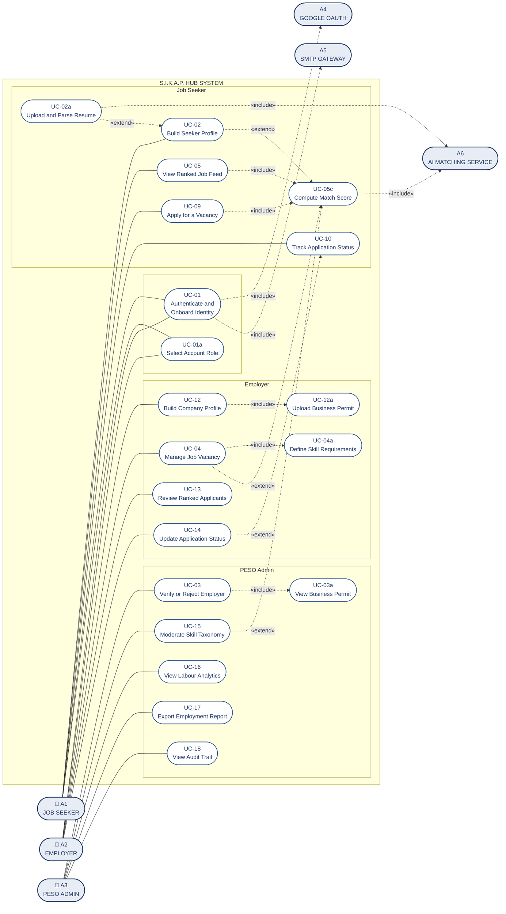
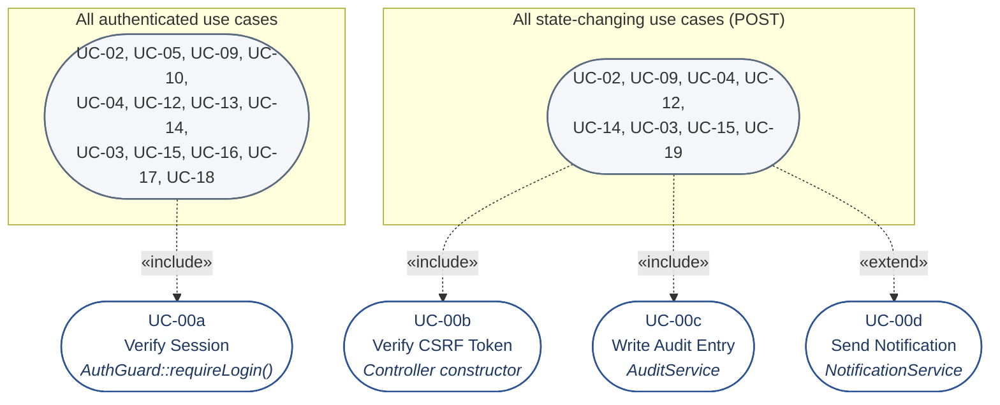

# Use Case Model and Specifications

**SMART INTEGRATED KNOWLEDGE & ABILITY PLATFORM (S.I.K.A.P.) HUB**

| | |
|---|---|
| Version | 2.0 |
| Date | 21 August 2026 |
| Derived from | M2 Locked System Flow · DFD Specification v2.0 · 26-relation 3NF schema |
| Contents | Actor model · Use case inventory · Routing map · Diagrams · Five IEEE specifications |

---

## 1. Actor model

| ID | Actor | Type | Description |
|---|---|---|---|
| **A1** | Job Seeker | Primary | Registered individual seeking employment through PESO Guimba |
| **A2** | Employer | Primary | Registered business posting vacancies. Subject to permit verification |
| **A3** | PESO Admin | Primary | Municipal employment office staff. Never self-registers |
| **A4** | Google OAuth Provider | Supporting | Third-party identity provider |
| **A5** | SMTP Gateway | Supporting | Third-party mail relay |
| **A6** | AI Matching Service | Supporting | Python FastAPI service computing match scores and extracting resume skills |

### 1.1 A note on A6, and why it is drawn as an actor

The DFD places the matching service **inside** the system boundary, because you build, deploy and version it. The use case diagram draws it as a **supporting actor**, because in UML an actor is anything the system interacts with across an interface to accomplish a use case — including a subsystem deployed separately.

Both are correct in their own notation, and the distinction is worth being able to state: the **DFD boundary is about ownership**, the **UML actor relationship is about interaction across an interface**. The network trust boundary is what makes the service an actor here and an internal process there.

If Sir Eli prefers strict consistency, the alternative is to draw A6 as a participating subsystem inside the boundary rather than as a stick-figure actor. That is a notation change only; the use cases do not move.

### 1.2 PESO Admin is not self-registering

A3 accounts are seeded or promoted by a SuperAdmin. There is no public route producing an admin account, and the role picker offers only Job Seeker and Employer. The diagram must not show A3 connected to *Select Account Role*.

---

## 2. Use case inventory and routing map

Routes marked **NEW** do not exist yet — this table doubles as the Phase 4 routing backlog. Routes marked **EXISTING** are drawn from the August code digest; verify each against your current `public/index.php` before submitting, since the file has changed since that snapshot.

### 2.1 Shared and included use cases

| ID | Use Case | Controller / Mechanism | Status |
|---|---|---|---|
| UC-00a | Verify Session | `AuthGuard::requireLogin()` | EXISTING |
| UC-00b | Verify CSRF Token | Base `Controller` constructor | EXISTING |
| UC-00c | Write Audit Entry | `AuditService` → `audit_logs` | **NEW** |
| UC-00d | Send Notification | `NotificationService` → `notifications`, `email_log` | **NEW** |

### 2.2 Job Seeker

| ID | Use Case | Route | Controller | Status |
|---|---|---|---|---|
| UC-01 | Authenticate and Onboard Identity | `GET /login`<br>`GET /auth/google`<br>`GET /auth/google/callback`<br>`POST /auth/otp/request`<br>`POST /auth/otp/verify` | `AuthController` | **NEW** (replaces password login) |
| UC-01a | Select Account Role | `GET POST /select-role` | `RoleController` | **NEW** |
| UC-02 | Build Seeker Profile | `GET POST /build-profile` | `ProfileController` | EXISTING |
| UC-02a | Upload and Parse Resume | `POST /resume/upload`<br>`GET /resume/suggestions` | `ResumeController` | **NEW** |
| UC-06 | Manage Skill Claims | `POST /profile/skills` | `ProfileController` | EXISTING |
| UC-07 | Set Preferred Work Locations | `POST /profile/locations` | `ProfileController` | EXISTING |
| UC-05 | View Ranked Job Feed | `GET /dashboard` | `JobSeekerController` | EXISTING — rewrite to read cache |
| UC-08 | Search and Filter Vacancies | `GET /jobs` | `JobSeekerController` | EXISTING |
| UC-09 | Apply for a Vacancy | `POST /apply` | `JobSeekerController` | EXISTING |
| UC-10 | Track Application Status | `GET /my-applications` | `JobSeekerController` | EXISTING |
| UC-11 | Manage Remembered Devices | `GET POST /account/devices` | `AccountController` | **NEW** |

### 2.3 Employer

| ID | Use Case | Route | Controller | Status |
|---|---|---|---|---|
| UC-01 | Authenticate and Onboard Identity | (shared with A1) | `AuthController` | **NEW** |
| UC-12 | Build Company Profile | `GET POST /build-profile` | `ProfileController` | EXISTING |
| UC-12a | Upload Business Permit | (within UC-12) | `FileUpload::secureUpload()` | EXISTING |
| UC-04 | Manage Job Vacancy | `GET POST /post-job`<br>`POST /jobs/publish` | `JobController` | EXISTING — add publish gate |
| UC-04a | Define Skill Requirements | (within UC-04) | `JobController` | EXISTING |
| UC-13 | Review Ranked Applicants | `GET /employer/dashboard`<br>`GET /employer/review-candidate` | `EmployerController` | EXISTING |
| UC-14 | Update Application Status | `POST /employer/application-status` | `EmployerController` | EXISTING |

### 2.4 PESO Admin

| ID | Use Case | Route | Controller | Status |
|---|---|---|---|---|
| UC-03 | Verify or Reject Employer | `GET /admin/employers`<br>`POST /admin/employers/verify` | `AdminController` | EXISTING |
| UC-03a | View Business Permit Document | `GET /admin/view-document` | `AdminController` | EXISTING — must be role-scoped |
| UC-15 | Moderate Skill Taxonomy | `GET /admin/skills`<br>`POST /admin/skills/approve` | `AdminController` | Partly **NEW** |
| UC-16 | View Labour Market Analytics | `GET /admin/dashboard` | `AdminController` | EXISTING |
| UC-17 | Export Employment Report | `GET /admin/export` | `AdminController` | EXISTING |
| UC-18 | View Audit Trail | `GET /admin/audit-logs` | `AdminController` | EXISTING — no data until UC-00c ships |
| UC-19 | Manage Account Status | `POST /admin/accounts/status` | `AdminController` | **NEW** |

### 2.5 Routes to delete

| Route | Reason |
|---|---|
| `GET POST /onboarding` | Legacy barangay-era flow, superseded by `/build-profile` (C-26 … C-29) |
| `GET /test-ai` | Unauthenticated debug endpoint exposing the AI service (C-18) |

---

## 3. Relationship model

### 3.1 `<<include>>` — mandatory, always executed

| Base use case | Includes |
|---|---|
| Every authenticated use case | UC-00a Verify Session |
| Every state-changing use case (all POST) | UC-00b Verify CSRF Token |
| UC-03, UC-04, UC-09, UC-14, UC-15, UC-19 | UC-00c Write Audit Entry |
| UC-12 Build Company Profile | UC-12a Upload Business Permit |
| UC-04 Manage Job Vacancy | UC-04a Define Skill Requirements |
| UC-03 Verify or Reject Employer | UC-03a View Business Permit Document |
| UC-09 Apply for a Vacancy | UC-05c Compute Authoritative Score |

### 3.2 `<<extend>>` — conditional, triggered by circumstance

| Extension | Extends | Condition |
|---|---|---|
| UC-02a Upload and Parse Resume | UC-02 Build Seeker Profile | Seeker chooses Path A rather than manual entry |
| UC-05r Recompute Match Scores | UC-02, UC-04, UC-15 | A profile, vacancy or skill approval changes scoring inputs |
| UC-00d Send Notification | UC-09, UC-14, UC-03 | The event has a notifiable counterparty |
| UC-03x Audit Permit Review | UC-03 | A verification decision is recorded |

**The distinction, stated for the panel.** `<<include>>` is behaviour the base use case *always* performs and cannot complete without — session checking, CSRF validation, permit upload during company registration. `<<extend>>` is behaviour that occurs only under a condition — a seeker who types their profile manually never triggers resume parsing. Getting these backwards is among the most commonly flagged errors in a use case submission.

---

## 4. System Use Case Diagram

### 4.1 Why this is drawn as two diagrams

UC-00a and UC-00b are included by roughly twenty use cases. Drawing forty `<<include>>` arrows onto one canvas produces an unreadable hairball, and it is the single most common way a use case diagram becomes unusable.

**Diagram A** shows actors and use cases with the domain-specific relationships. **Diagram B** shows the cross-cutting included use cases separately, with a note on Diagram A stating that all authenticated use cases include UC-00a and all state-changing use cases include UC-00b. This is standard practice for cross-cutting concerns and reads far better than the alternative.

### 4.2 ASCII layout blueprint for Lucidchart

```
   A1 JOB SEEKER                SYSTEM BOUNDARY                    A2 EMPLOYER
   ┌──────────┐   ┌──────────────────────────────────────────┐   ┌──────────┐
   │          │   │                                          │   │          │
   │    ○     │   │   ╭──────────────────────────────────╮   │   │    ○     │
   │   ╱│╲    │───┼──▶│ UC-01  Authenticate and Onboard  │◀──┼───│   ╱│╲    │
   │    │     │   │   ╰──────────────┬───────────────────╯   │   │    │     │
   │   ╱ ╲    │   │                  │                       │   │   ╱ ╲    │
   └──────────┘   │        ╭─────────▼─────────╮             │   └──────────┘
        │         │        │ UC-01a Select Role│             │        │
        │         │        ╰───────────────────╯             │        │
        │         │                                          │        │
        │         │  ── SEEKER LANE ──   ── EMPLOYER LANE ── │        │
        ├─────────┼─▶╭───────────────╮   ╭────────────────╮◀─┼────────┤
        │         │  │UC-02 Build    │   │UC-12 Build     │  │        │
        │         │  │Seeker Profile │   │Company Profile │  │        │
        │         │  ╰───────┬───────╯   ╰───────┬────────╯  │        │
        │         │          ┊«extend»           │«include»  │        │
        │         │  ╭───────▼───────╮   ╭───────▼────────╮  │        │
        │         │  │UC-02a Upload  │   │UC-12a Upload   │  │        │
        │         │  │Parse Resume   │   │Business Permit │  │        │
        │         │  ╰───────────────╯   ╰────────────────╯  │        │
        │         │                                          │        │
        ├─────────┼─▶╭───────────────╮   ╭────────────────╮◀─┼────────┤
        │         │  │UC-05 View     │   │UC-04 Manage    │  │        │
        │         │  │Ranked Feed    │   │Job Vacancy     │  │        │
        │         │  ╰───────┬───────╯   ╰───────┬────────╯  │        │
        │         │          │«include»          │«include»  │        │
        │         │  ╭───────▼───────╮   ╭───────▼────────╮  │        │
        │         │  │UC-05c Compute │   │UC-04a Define   │  │        │
        │         │  │Match Score    │   │Skill Weighting │  │        │
        │         │  ╰───────┬───────╯   ╰────────────────╯  │        │
        │         │          │                               │        │
        ├─────────┼─▶╭───────────────╮   ╭────────────────╮◀─┼────────┤
        │         │  │UC-09 Apply    │──▶│UC-13 Review    │  │        │
        │         │  │for Vacancy    │   │Ranked Applicant│  │        │
        │         │  ╰───────────────╯   ╰───────┬────────╯  │        │
        │         │                              │           │        │
        └─────────┼─▶╭───────────────╮   ╭───────▼────────╮◀─┼────────┘
                  │  │UC-10 Track    │◀──│UC-14 Update    │  │
                  │  │Application    │   │App Status      │  │
                  │  ╰───────────────╯   ╰────────────────╯  │
                  │                                          │
                  │  ────────── ADMIN LANE ──────────        │
                  │  ╭──────────────╮  ╭──────────────────╮  │   A3 PESO ADMIN
                  │  │UC-03 Verify  │  │UC-15 Moderate    │  │   ┌──────────┐
                  │  │Employer      │  │Skill Taxonomy    │◀─┼───│    ○     │
                  │  ╰──────┬───────╯  ╰──────────────────╯  │   │   ╱│╲    │
                  │  «include»                               │   │    │     │
                  │  ╭──────▼───────╮  ╭──────────────────╮  │   │   ╱ ╲    │
                  │  │UC-03a View   │  │UC-16 Analytics   │◀─┼───└──────────┘
                  │  │Permit Doc    │  │UC-17 Export PDF  │  │        │
                  │  ╰──────────────╯  │UC-18 Audit Trail │◀─┼────────┘
                  │                    ╰──────────────────╯  │
                  └──────────────────────────────────────────┘
                          ▲                  ▲            ▲
                          │                  │            │
                  ┌───────┴──────┐  ┌────────┴─────┐  ┌───┴──────────┐
                  │ A4 GOOGLE    │  │ A5 SMTP      │  │ A6 AI        │
                  │ OAUTH        │  │ GATEWAY      │  │ MATCHING SVC │
                  └──────────────┘  └──────────────┘  └──────────────┘

  NOTE ON THE CANVAS:
  All authenticated use cases «include» UC-00a Verify Session.
  All state-changing use cases «include» UC-00b Verify CSRF Token.
  Shown separately in Diagram B to preserve readability.
```

### 4.3 Diagram A — Mermaid source



### 4.4 Diagram B — Cross-cutting included use cases



---

## 5. Formal Use Case Specifications

---

### UC-01 — Multi-role Authentication and Identity Onboarding

| Field | Content |
|---|---|
| **ID** | UC-01 |
| **Name** | Multi-role Authentication and Identity Onboarding |
| **Primary Actor** | A1 Job Seeker, A2 Employer |
| **Supporting Actors** | A4 Google OAuth Provider, A5 SMTP Gateway |
| **Stakeholders** | Seekers and employers needing frictionless access; PESO requiring verified identity |
| **Trigger** | Visitor selects *Continue with Google* or *Continue with Email* |
| **Frequency** | Every session |
| **Routes** | `GET /login` · `GET /auth/google` · `GET /auth/google/callback` · `POST /auth/otp/request` · `POST /auth/otp/verify` · `GET POST /select-role` |
| **Includes** | UC-00b Verify CSRF Token (on OTP POST) |

**Preconditions**

1. The visitor has a working email address.
2. Google OAuth credentials are configured, and the callback URL is registered.
3. The SMTP gateway is reachable.

**Main Success Scenario — Path A, Google**

1. Visitor selects *Continue with Google*.
2. System generates a random `state` and `nonce`, stores both in the session.
3. System redirects to Google with the authorization request.
4. Visitor authenticates with Google and grants consent.
5. Google redirects to the callback with an authorization code.
6. System verifies the returned `state` matches the stored value, then consumes it.
7. System exchanges the code for an ID token.
8. System verifies the token signature against Google's public keys, and validates `iss`, `aud`, `exp` and `nonce`.
9. System reads the verified email and the `sub` claim.
10. System looks up `users.email`. If absent, it creates a `users` row with `role = NULL` and `account_status = 'Pending'`.
11. System writes a `user_auth_identities` row with `provider = 'google'` and `provider_uid = sub`.
12. System sets `email_verified_at`, calls `session_regenerate_id(true)`, and writes a `login_success` audit entry.
13. Because `role` is NULL, System redirects to the role picker.
14. Visitor selects Job Seeker or Employer.
15. System stores the role, regenerates the session identifier again, writes a `role_selected` audit entry, and redirects to the matching profile builder.

**Main Success Scenario — Path B, Email OTP**

1. Visitor enters an email address and submits.
2. System validates the CSRF token and applies rate limiting by address and by IP.
3. System generates a six-digit code, hashes it, and writes an `email_otp_codes` row expiring in ten minutes.
4. System queues the message and writes an `email_log` row with `send_status = 'queued'`.
5. A5 delivers the message; System updates `send_status` to `sent`.
6. System displays the code entry screen with a response identical whether or not the address is registered.
7. Visitor enters the code.
8. System retrieves the newest unconsumed, unexpired row for that address and verifies the hash.
9. On match, System sets `consumed_at` and proceeds from step 10 of Path A, with `provider = 'email'`.

**Alternative Flows**

- **A1 — Returning user, remembered device.** A valid unexpired `user_devices` token is presented. System verifies the token hash and user-agent hash, rotates the token, updates `last_used_at`, and skips OTP entirely. Never applied to A3 accounts.
- **A2 — Second provider, same address.** The email already exists in `users`. System adds a second `user_auth_identities` row rather than creating a duplicate account.
- **A3 — Role already selected.** `role` is non-NULL. System skips the role picker and routes to the role's dashboard.

**Exception Flows**

- **E1 — State mismatch on callback.** System discards the response, writes a `login_failed` audit entry, and returns the visitor to the login screen with a generic error. No account is created.
- **E2 — ID token fails verification.** As E1. The token is never trusted on the basis of its payload alone.
- **E3 — SMTP delivery fails.** `email_log.send_status` is set to `failed` with the error text. The visitor sees a resend option. The failure is never silent.
- **E4 — Code expired.** System rejects the code and offers to issue a new one.
- **E5 — Five failed attempts.** System invalidates the code, writes an `otp_failed` audit entry, and requires a fresh request.
- **E6 — Suspended account.** Authentication succeeds; authorization does not. System terminates the session and displays a contact message.
- **E7 — Reused device token.** A token already marked consumed is presented. System treats this as theft: every `user_devices` row for that account is revoked and full re-authentication is required.

**Postconditions**

- *Success:* an authenticated session exists; `users.role` is populated; `email_verified_at` is set; audit entries are written.
- *Failure:* no session is created; no partial account persists; the attempt is recorded in `audit_logs`.

**Business rules**

- BR-1: No passwords exist anywhere in the system.
- BR-2: `provider_uid` stores Google's `sub` claim, never the Google email, which can change.
- BR-3: Login responses must not reveal whether an address is registered.
- BR-4: A3 accounts are never created through this use case.

**Non-functional**

- Session cookie: `HttpOnly`, `SameSite=Lax`, `Secure` only when the request is over HTTPS.
- `SameSite=Strict` must not be used — the browser would withhold the cookie on the OAuth callback navigation and the flow would fail.
- Session fingerprint uses the User-Agent hash. IP is not used as a hard match, because Philippine mobile carriers rotate client addresses mid-session.
- Idle timeout 30 minutes.

---

### UC-02 — Resume Intake, Text Extraction and Skill Claim Normalization

| Field | Content |
|---|---|
| **ID** | UC-02 |
| **Name** | Resume Intake, Text Extraction and Skill Claim Normalization |
| **Primary Actor** | A1 Job Seeker |
| **Supporting Actor** | A6 AI Matching Service (parser endpoint) |
| **Trigger** | Seeker chooses *Upload a resume* on the profile builder |
| **Routes** | `POST /resume/upload` · `GET /resume/suggestions` · `POST /build-profile` |
| **Extends** | UC-02 Build Seeker Profile — Path A only |
| **Includes** | UC-00a, UC-00b |

**Preconditions**

1. Seeker is authenticated with `role = 'jobseeker'`.
2. `master_skills` contains approved skills to match against.
3. The parser endpoint is reachable.

**Main Success Scenario**

1. Seeker selects a PDF or DOCX file and submits.
2. System validates the CSRF token.
3. System inspects magic bytes with `finfo` to confirm the true type. The file extension is not trusted.
4. System enforces the size limit and computes a SHA-256 hash.
5. System stores the file under a randomized filename and writes a `resume_uploads` row with `parse_status = 'pending'`.
6. System extracts text via PyPDF2 or python-docx.
7. System retrieves the approved vocabulary from `master_skills`.
8. System matches extracted text against skill names and assembles candidate field values: name, contact details, education entries, work history entries, and skill identifiers.
9. System writes the result to `parsed_payload`, sets `parse_status = 'parsed'`, and records `parser_version`.
10. System renders the profile builder pre-filled, with parsed values visually marked as *suggested*.
11. Seeker reviews every field, edits what is wrong, and removes what does not apply.
12. Seeker submits the confirmed profile.
13. System writes `job_seekers`, `education`, `work_experience`, `jobseeker_skills` and `preferred_work_locations` in a single transaction.
14. System recomputes `profile_completeness`, sets `account_status = 'Active'`, and links `resume_uploads.jobseeker_id`.
15. System triggers T1, recomputing match scores against all open vacancies.

**Alternative Flows**

- **A1 — Path B, manual entry.** Seeker skips the upload. Steps 6 to 10 do not occur; the builder opens empty. All later steps are identical.
- **A2 — Partial extraction.** Only some fields are recovered. Recovered fields are pre-filled; the rest stay blank. This is a normal outcome, not an error.
- **A3 — Skill not in the taxonomy.** Seeker proposes a new skill. System writes a `master_skills` row with `status = 'pending'` and `submitted_by_user_id`. The skill is stored but excluded from scoring until UC-15 approves it.

**Exception Flows**

- **E1 — Type mismatch.** Magic bytes contradict the extension. System rejects the upload, stores nothing, and reports an unsupported file.
- **E2 — Extraction yields no text.** Typically a scanned image PDF. `parse_status = 'failed'`, `parse_error` records the reason, and System offers manual entry. The seeker is never blocked.
- **E3 — Parser unreachable.** System sets `parse_status = 'failed'` and falls back to manual entry. The upload is retained for later reprocessing.
- **E4 — Transaction failure on save.** Full rollback; no partial profile persists; the seeker is returned to the form with entered data intact.

**Postconditions**

- *Success:* a complete seeker profile exists; the account is Active; scores are queued for computation; the upload row records which parser build produced the payload.
- *Failure:* no partial profile is written; the account remains Pending.

**Business rules**

- BR-1: Parsed values are **suggestions**. Nothing reaches `job_seekers`, `education`, `work_experience` or `jobseeker_skills` without explicit seeker confirmation.
- BR-2: Only `status = 'approved'` skills participate in match scoring.
- BR-3: `parsed_payload` is a transient staging buffer. Once confirmed, the authoritative data lives in the normalized relations.
- BR-4: The parser performs no accept, reject or qualification judgement. It extracts and suggests only.
- BR-5: Path A and Path B converge on the same review screen, the same validation, and the same save routine.

**Non-functional**

- `parser_version` must be recorded on every row so field-level extraction accuracy can be measured and reported in Chapter IV.
- Extraction is best-effort. No accuracy claim is made to the user; the confirmation step is what makes the feature safe.

---

### UC-03 — Employer Verification and Business Permit Auditing

| Field | Content |
|---|---|
| **ID** | UC-03 |
| **Name** | Employer Verification and Business Permit Auditing |
| **Primary Actor** | A3 PESO Admin |
| **Supporting Actor** | A5 SMTP Gateway |
| **Stakeholders** | Job seekers relying on employer legitimacy; PESO carrying reputational responsibility |
| **Trigger** | An employer submits a company profile, entering the verification queue |
| **Routes** | `GET /admin/employers` · `GET /admin/view-document` · `POST /admin/employers/verify` |
| **Includes** | UC-00a, UC-00b, UC-00c, UC-03a View Business Permit Document |
| **Extends** | UC-00d Send Notification |

**Preconditions**

1. Admin is authenticated with `users.role = 'admin'` and a `peso_admins` row.
2. `access_level` is SuperAdmin or Moderator. Viewer may read the queue but not decide.
3. At least one employer holds `verified_status = 'Pending'`.

**Main Success Scenario**

1. Admin opens the verification queue.
2. System lists pending employers with company name, contact details, municipality and submission date.
3. Admin opens an entry and reviews the profile.
4. Admin opens the business permit document.
5. System confirms the requester holds an admin role before streaming the file, then serves it.
6. Admin compares the permit against the submitted details.
7. Admin selects Verify or Reject and may add remarks.
8. System validates the CSRF token.
9. System sets `verified_status` and `verified_at`.
10. System writes an `audit_logs` entry of type `employer_verified` or `employer_rejected`, capturing admin, employer, timestamp, IP and user agent.
11. System queues a notification and an email to the employer.
12. On verification, every posting by that employer immediately gains the green badge and moves to the upper feed tier — no per-posting update occurs, because verification status is read by join.

**Alternative Flows**

- **A1 — Rejection.** `verified_status = 'Rejected'` and `verified_at` is set. In the same transaction, every posting by that employer with `job_status = 'Open'` moves to `job_status = 'Suspended'`, so a rejected business keeps no live vacancies in seeker feeds (D-18 — a rejected employer's postings must not sit in the feed wearing the same amber badge as a not-yet-reviewed one). Suspension is reversible; the rows are not deleted. The rejection audit entry records how many postings were suspended. Remarks are mandatory so the employer can correct and resubmit. Note: approval does not restore `job_status`, and there is no job-edit route yet, so a rejected-then-approved employer must re-create or wait for a future edit path to reopen those postings.
- **A2 — Resubmission.** A rejected employer uploads a new permit. Status returns to Pending and the entry re-enters the queue. Prior decisions remain in the audit trail.
- **A3 — Viewer access level.** Queue is readable; decision controls are absent, and a direct POST is rejected.

**Exception Flows**

- **E1 — Missing permit file.** The database path does not resolve on disk. System reports the failure and blocks the decision rather than serving an empty document.
- **E2 — Non-admin requests the document endpoint.** The role check fails; System returns 403 and writes a `login_failed` audit entry. This endpoint must be role-scoped — it serves uploaded business documents.
- **E3 — Notification delivery fails.** The decision stands and is committed. `email_log.send_status = 'failed'` records the error. Verification does not depend on mail delivery.
- **E4 — Concurrent decisions.** Two admins act on the same employer. Last write wins; both attempts appear in the audit trail.

**Postconditions**

- *Success:* verification state is recorded; an audit entry exists; the employer is notified; badge and feed tier update system-wide.
- *Failure:* status is unchanged; the attempt is logged.

**Business rules**

- BR-1: An unverified employer may register, complete a profile, draft and publish vacancies.
- BR-2: Postings by a **Pending** (not-yet-reviewed) employer appear in the seeker feed with an amber badge, ranked below all verified listings, and still display their match percentage. Postings by a **Rejected** employer do not appear in the feed at all — they are suspended on rejection (D-18, see A1) and the feed is `job_status = 'Open'` only.
- BR-3: Verification status lives only on `employers`. It is never copied to `job_postings`.
- BR-4: Every decision writes an audit entry. There are no unlogged verification actions.
- BR-5: Viewer access level cannot decide.

---

### UC-04 — Job Vacancy Management and Skill Requirement Weighting

| Field | Content |
|---|---|
| **ID** | UC-04 |
| **Name** | Job Vacancy Management and Skill Requirement Weighting |
| **Primary Actor** | A2 Employer |
| **Supporting Actor** | A6 AI Matching Service |
| **Trigger** | Employer selects *Post a job* |
| **Routes** | `GET POST /post-job` · `POST /jobs/publish` |
| **Includes** | UC-00a, UC-00b, UC-00c, UC-04a Define Skill Requirements |
| **Extends** | UC-05r Recompute Match Scores |

**Preconditions**

1. Employer is authenticated with a complete `employers` row.
2. `master_skills` and `lib_municipalities` are populated.

**Main Success Scenario**

1. Employer opens the posting form.
2. Employer enters title, description, salary range, minimum years of experience, employment type and work arrangement.
3. Employer selects the workplace municipality from the PSGC hierarchy.
4. Employer adds required skills through the typeahead, marking each **Mandatory** or **Preferred**.
5. System validates that at least one Mandatory skill is present.
6. Employer saves as draft or publishes.
7. System validates the CSRF token and confirms ownership of the employer record.
8. System writes `job_postings` with `job_status` of `Draft` or `Open`, and `job_required_skills` rows carrying `requirement_type`.
9. System writes a `job_created` audit entry.
10. On publish, System triggers T2, recomputing scores for this vacancy against all active seekers.
11. Scores are written to `job_match_scores`; the vacancy appears in seeker feeds in the tier matching the employer's verification status.

**Alternative Flows**

- **A1 — Save as draft.** `job_status = 'Draft'`. No trigger fires; the vacancy is invisible to seekers.
- **A2 — Edit a published vacancy.** Changes to skill requirements or municipality fire T2 again. Existing `job_match_scores` rows are overwritten; `applications.ai_match_score` values are untouched.
- **A3 — Skill not in the taxonomy.** Employer proposes a new skill. It is written with `status = 'pending'` and excluded from scoring until approved.
- **A4 — Close a vacancy.** `job_status = 'Closed'`. It leaves seeker feeds; existing applications remain visible in the tracker.

**Exception Flows**

- **E1 — No Mandatory skill.** System rejects the submission. A vacancy with only Preferred skills produces a denominator that cannot distinguish candidates meaningfully.
- **E2 — Ownership mismatch.** The `employer_id` does not belong to the session user. System returns 403 and logs the attempt. Ownership is enforced by JOIN, not by trusting a form field.
- **E3 — Matching service unreachable on publish.** The vacancy is published and committed. Score computation is queued for retry. The feed shows the vacancy without a percentage until scores exist — it does **not** display a fabricated score.
- **E4 — Duplicate skill on one vacancy.** Prevented by the composite primary key on `job_required_skills`.

**Postconditions**

- *Success:* the vacancy exists with weighted requirements; scores are computed or queued; an audit entry is written.
- *Failure:* nothing is written; the employer returns to the form with input preserved.

**Business rules**

- BR-1: `requirement_type` is `Mandatory` or `Preferred`. The value `Optional` does not exist in this system.
- BR-2: Mandatory carries weight 2.0, Preferred weight 1.0.
- BR-3: At least one Mandatory skill is required.
- BR-4: `min_years_experience` is an integer, displayed to seekers but not scored in version 1.
- BR-5: `work_arrangement` is displayed against the seeker's `preferred_work_setup` but is not scored in version 1.

---

### UC-05 — Automated Match Score Computation and Dual-Key Ranked Feed

| Field | Content |
|---|---|
| **ID** | UC-05 |
| **Name** | Automated Match Score Computation and Dual-Key Ranked Feed Delivery |
| **Primary Actor** | A1 Job Seeker |
| **Supporting Actor** | A6 AI Matching Service |
| **Trigger** | Seeker opens the dashboard; or T1, T2, T4 or T7 fires |
| **Routes** | `GET /dashboard` · `POST /apply` · internal `POST /api/v1/compute-batch`, `POST /api/v1/compute-match` |
| **Includes** | UC-00a, UC-05c Compute Match Score |

**Preconditions**

1. Seeker is authenticated with an Active profile.
2. At least one vacancy has `job_status = 'Open'`.
3. For live computation, the matching service is reachable and shares the HMAC secret.

**Main Success Scenario — computation, triggered**

1. A trigger fires: T1 profile change, T2 vacancy published, T4 application submitted, T7 skill approved.
2. System assembles the payload — seeker skill identifiers, job requirements with `requirement_type`, job municipality, seeker home municipality, preferred municipalities.
3. System resolves municipality to province via the PSGC hierarchy for the province tier.
4. System computes HMAC-SHA256 over the raw body and attaches the signature and Bearer token.
5. System POSTs to the matching service.
6. Service recomputes the HMAC and compares in constant time.
7. Service computes the weighted skill score: `(2 × mandatory_met + 1 × preferred_met) ÷ (2 × mandatory_total + 1 × preferred_total)`.
8. Service computes the geographic multiplier — 1.00 same municipality, 0.90 preferred municipality, 0.75 same province, 0.50 different province, 1.00 when the seeker has no location data.
9. Service returns `final_score = skill_score × geo_multiplier`, with raw Jaccard and diagnostics.
10. System writes rows to `job_match_scores` including `engine_version`.

**Main Success Scenario — feed delivery**

11. Seeker opens the dashboard.
12. System reads `job_match_scores` for that seeker, joined to `job_postings` and `employers`. **No request is made to the matching service.**
13. System orders by `employers.verified_status = 'Verified'` descending, then `final_score` descending, then summed proficiency ordinal over matched mandatory skills descending, then `profile_completeness` descending, then `jobseeker_id` ascending.
14. System renders each card with title, employer, municipality, work arrangement, verification badge and **match percentage — displayed on every card regardless of badge state**.
15. Seeker may open a vacancy to see which requirements are met and which are missing.

**Alternative Flows**

- **A1 — Application submitted.** T4 performs one authoritative live computation. The result is written to `applications.ai_match_score` and never recalculated. This is the value the employer evaluates.
- **A2 — Incomplete location data.** The multiplier is 1.00, neutral. The card carries a prompt to complete the profile. Missing data is not treated as evidence of poor fit.
- **A3 — Employer view.** UC-13 reads stored `applications.ai_match_score` values. It performs no computation.
- **A4 — Cache miss.** No row exists for a pair. The vacancy appears without a percentage and computation is queued. No placeholder score is shown.

**Exception Flows**

- **E1 — Signature verification fails.** The service returns HTTP 401. System logs the failure and does not write scores. No default score is produced.
- **E2 — Service unreachable.** System logs the failure and serves the feed from cache, marking uncomputed vacancies as pending rather than scored.
- **E3 — Vacancy has zero requirements.** Prevented upstream by UC-04 BR-3.
- **E4 — Stale scores after a vacancy edit.** T2 overwrites affected rows. `computed_at` and `engine_version` allow stale rows to be identified.

**Postconditions**

- *Success:* `job_match_scores` holds current scores; the feed is ordered by the dual key; every card shows a percentage.
- *Failure:* no fabricated scores are written or displayed; the failure is recorded.

**Business rules**

- BR-1: `final_score` ranges 0.0000 to 1.0000. A perfect match in the exact municipality scores 1.0000 and displays as 100%.
- BR-2: There is no fixed multiplier capping the score. The previous `× 0.40` constant is removed.
- BR-3: Verification status is the primary sort key; match score is secondary. This is a deliberate candidate-safety decision and must be documented as such.
- BR-4: Every card displays its match percentage, verified or pending.
- BR-5: The dashboard makes zero calls to the matching service. Only T4 is on a user's blocking path.
- BR-6: Raw Jaccard is reported as a diagnostic baseline and is not a component of `final_score`.
- BR-7: A failure never produces a score. An error is preferable to a plausible wrong number.

**Non-functional**

- Dashboard load is **one database round trip, constant in card count** — the
  feed query, plus three flat supporting queries (approved skill set, one
  batched `job_required_skills` lookup for the whole feed, seeker context).
  Zero per-card queries, zero calls to the matching service. It is **not** a
  single index range scan on `idx_seeker_rank`: the third feed-ordering key
  (summed proficiency ordinal over matched Mandatory skills, §6.6 / D-14) is
  computed at read time from `job_required_skills` × `jobseeker_skills`, and
  the feed is a LEFT JOIN from `job_postings` (so unscored open jobs still
  appear), so the optimiser sorts a temporary set rather than walking the
  index in order. The set is bounded by the number of open vacancies, which
  is small for a single PESO office. `idx_seeker_rank` still serves the
  `eq_ref` lookup of each job's score row.

  EXPLAIN (fixture: 6 open vacancies, seeker Maria):

  ```
  id  select_type         table  type    key             rows  Extra
  1   PRIMARY             jp     ALL     (job_status)     7     Using where; Using temporary; Using filesort
  1   PRIMARY             m      eq_ref  PRIMARY          1
  1   PRIMARY             s      eq_ref  PRIMARY          1
  1   PRIMARY             a      eq_ref  uq_application   1     Using index
  1   PRIMARY             e      ALL     -                2     Using where; Using join buffer (BNL)
  1   PRIMARY             u      eq_ref  PRIMARY          1     Using where
  2   DEPENDENT SUBQUERY  jrs    ref     PRIMARY          1     Using where
  2   DEPENDENT SUBQUERY  jss    eq_ref  PRIMARY          1
  2   DEPENDENT SUBQUERY  ms     eq_ref  PRIMARY          1     Using where
  ```

- The 2:1 Mandatory-to-Preferred weighting must be justified in Chapter III, with a sensitivity comparison at 1.5:1, 2:1 and 3:1.

---

## 6. Verification checklist before submitting

| Check | Why |
|---|---|
| Every use case maps to a route | No orphan use cases. The March diagram showed *View System Audit Logs* with no data source behind it |
| Routes marked NEW appear in the Gantt | They are unbuilt work, not documentation |
| A3 is not connected to UC-01a | Admins never choose a role |
| `<<include>>` and `<<extend>>` are not reversed | The most commonly flagged use case diagram error |
| `/onboarding` and `/test-ai` are absent | Deleted routes must not appear as use cases |
| UC-18 shows a data source | It stays empty until UC-00c ships |

---

## 7. Open item

UC-00c *Write Audit Entry* is included by six use cases and does not exist in code. Until `AuditService` is built, six specifications describe behaviour the system does not perform, and UC-18 *View Audit Trail* has nothing to display. This is the highest-priority item in the Phase 4 backlog that is visible from the use case model.
